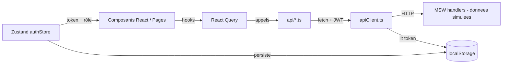
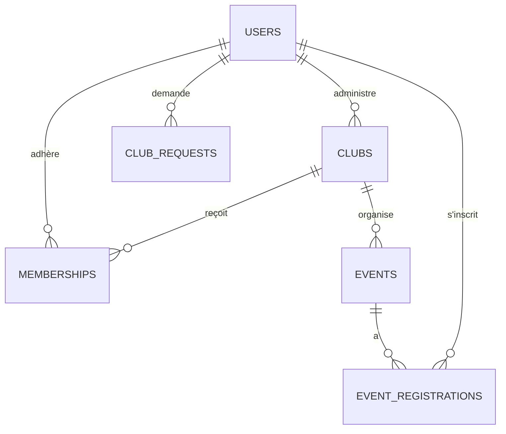

# Architecture du projet — UniClubs Platform (Frontend)

> Plateforme web de gestion des clubs et associations universitaires.
> Document de référence pour la rédaction du rapport — **périmètre : frontend uniquement**.
>
> *Ce document décrit l'application frontend existante. La connexion à une API réelle sera réalisée dans une étape ultérieure ; en attendant, le front fonctionne de manière autonome grâce à des données simulées (MSW).*

---

## 1. Vue d'ensemble

**UniClubs Platform** est une application web monopage (SPA) permettant de gérer les clubs universitaires, les adhésions, les événements, les annonces, les documents et un chatbot FAQ. L'application gère **4 rôles** avec des permissions différentes. Le frontend est **autonome** : il tourne sans serveur grâce à des **données simulées (mock)** via MSW.

| Élément | Détail |
|--------|--------|
| Type d'application | SPA (Single Page Application) |
| Périmètre | **Frontend** |
| Langage | TypeScript |
| Framework UI | React 18 |
| Build / Dev server | Vite 5 |
| Port de développement | `http://localhost:3000` |
| Données | Simulées (MSW) — aucun serveur requis |

---

## 2. Stack technique

### Frontend
| Catégorie | Technologie | Rôle |
|-----------|-------------|------|
| Langage | **TypeScript 5** | Typage statique |
| Librairie UI | **React 18** | Composants |
| Bundler | **Vite 5** | Dev server + build |
| Composants visuels | **MUI (Material UI) 5** + `@mui/icons-material` + `@mui/x-data-grid` | Design system, tableaux de données |
| Style | **Emotion** (`@emotion/react`, `@emotion/styled`) | CSS-in-JS (utilisé par MUI) |
| Routing | **React Router DOM 6** | Navigation et routes protégées |
| État serveur (data fetching) | **TanStack React Query 5** | Cache, requêtes, mutations |
| État global (client) | **Zustand 4** | Store d'authentification (avec persistance) |
| Formulaires | **React Hook Form 7** + **Zod** (`@hookform/resolvers`) | Gestion + validation des formulaires |
| QR Codes | **qrcode.react** | Check-in des événements |

### Outils de développement / qualité
| Catégorie | Technologie |
|-----------|-------------|
| Mock API | **MSW (Mock Service Worker) 2** |
| Tests | **Vitest** + **Testing Library** + **jsdom** |
| Lint / Format | **ESLint** + **Prettier** |

---

## 3. Architecture logicielle

Le projet suit une architecture **« feature-based »** (organisation par fonctionnalité métier) combinée à une couche partagée (`shared`) et une couche applicative (`app`).

```
src/
├── main.tsx                 # Point d'entrée : bootstrap, démarrage MSW, montage React
├── app/                     # Couche application (composition globale)
│   ├── App.tsx              # Assemble les Providers + le Router
│   ├── router.tsx           # Définition de toutes les routes
│   └── providers/           # Providers transverses
│       ├── ThemeProvider.tsx     # Thème MUI
│       ├── QueryProvider.tsx     # Client React Query
│       └── SnackbarContext.tsx   # Notifications toast
├── layout/                  # Structure visuelle (coquille de l'app)
│   ├── MainLayout.tsx       # Layout principal (barre + menu latéral)
│   ├── AppTopBar.tsx        # Barre supérieure
│   ├── SideDrawer.tsx       # Menu latéral (selon le rôle)
│   └── PublicLayout.tsx     # Layout public
├── features/                # Modules métier (le cœur de l'app)
│   ├── auth/                # Authentification, profil, rôles
│   ├── clubs/               # Clubs
│   ├── memberships/         # Adhésions
│   ├── events/              # Événements
│   ├── announcements/       # Annonces
│   ├── documents/           # Documents
│   ├── notifications/       # Notifications
│   ├── chatbot/             # Chatbot FAQ
│   ├── club-requests/       # Demandes de création de club
│   ├── admin/               # Pages d'administration (plateforme + club)
│   └── dashboard/           # Tableaux de bord
├── shared/                  # Code réutilisable
│   ├── api/apiClient.ts     # Wrapper fetch (JWT, erreurs, timeout)
│   ├── components/          # Composants génériques (EmptyState, ErrorState…)
│   └── types/               # Types TypeScript de toutes les entités
└── mocks/                   # Backend simulé (MSW)
    ├── handlers.ts          # Définition des endpoints simulés
    ├── data.ts              # Données de démonstration
    ├── browser.ts           # Worker MSW
    └── devSwitch.ts         # Personas de dev (changement de rôle rapide)
```

### Structure type d'une *feature*
Chaque module métier suit la même organisation interne :
```
features/<module>/
├── api/        # Appels API (avec apiClient) + clés React Query
├── components/ # Composants spécifiques au module
├── hooks/      # Hooks personnalisés (ex: useAuth)
├── pages/      # Pages (écrans) rattachées aux routes
└── store/      # Store Zustand (ex: authStore)
```

---

## 4. Flux de données



1. Une **page** utilise un **hook React Query** (`useQuery` / `useMutation`).
2. Le hook appelle une fonction du dossier **`api/`** du module.
3. Cette fonction passe par **`apiClient.ts`**, qui :
   - ajoute le token JWT (`Authorization: Bearer …`) lu depuis `localStorage`,
   - gère le `Content-Type`, un **timeout de 10 s** (via `AbortController`),
   - gère les erreurs avec une classe `ApiError` (statut + message),
   - redirige vers `/login` automatiquement en cas de **401**.
4. **MSW** intercepte les requêtes HTTP et renvoie des **données simulées**, ce qui rend le front entièrement autonome.

---

## 5. Gestion des états

| Type d'état | Outil | Détails |
|-------------|-------|---------|
| État **serveur** (données distantes) | React Query | Cache de 5 min (`staleTime`), 1 retry, DevTools intégrés |
| État **global client** (auth) | Zustand (`authStore`) | `user`, `accessToken`, `isAuthenticated`, `activeRole` ; persisté dans `localStorage` (clé `auth-store`) |
| État **local** (formulaires) | React Hook Form + Zod | Validation déclarative par schéma |
| Notifications UI | Contexte `SnackbarContext` | Messages toast globaux |

---

## 6. Authentification et autorisation

### Rôles (`UserRole`)
- `PLATFORM_ADMIN` — administrateur de la plateforme
- `CLUB_ADMIN` — administrateur d'un (ou plusieurs) club(s)
- `MEMBER` — membre / étudiant
- `VISITOR` — visiteur (mode consultation, non authentifié)

> Le système gère le **multi-rôle** : un utilisateur peut avoir plusieurs rôles (`roles[]`) et basculer entre eux via `switchRole` / `activeRole`.

### Mécanismes de protection des routes
| Composant | Rôle |
|-----------|------|
| `ProtectedRoute` | Bloque l'accès aux utilisateurs non authentifiés |
| `RoleGate` | Affiche le contenu uniquement si l'utilisateur possède un des rôles requis (`hasAnyRole`) sinon message « Accès refusé » |
| `HomeRedirect` | Redirige vers le tableau de bord correspondant au rôle |

### Flux JWT
- Le token est stocké dans `localStorage` (`access_token`).
- `apiClient` l'ajoute à chaque requête.
- Une réponse **401** purge le token et redirige vers `/login?next=…`.

---

## 7. Routage (principales routes)

| Route | Accès | Page |
|-------|-------|------|
| `/login`, `/register` | Public (hors layout) | Connexion / Inscription |
| `/clubs`, `/clubs/:id` | **Public (Visiteur)** | Liste / détail des clubs |
| `/events`, `/events/:id` | **Public (Visiteur)** | Liste / détail des événements |
| `/dashboard` | Authentifié | Tableau de bord générique |
| `/admin/dashboard` | `PLATFORM_ADMIN` | Tableau de bord plateforme |
| `/club-admin/dashboard` | `CLUB_ADMIN` | Tableau de bord club |
| `/member/dashboard` | `MEMBER` | Tableau de bord membre |
| `/admin/validate-clubs` | `PLATFORM_ADMIN` | Validation des clubs |
| `/admin/users` | `PLATFORM_ADMIN` | Gestion des utilisateurs |
| `/admin/chatbot` | `PLATFORM_ADMIN` | Administration du chatbot |
| `/admin/club-requests` | `PLATFORM_ADMIN` | Gestion des demandes de club |
| `/club-requests/new` | `MEMBER` | Demande de création de club |
| `/clubs/:clubId/members` | `CLUB_ADMIN`, `PLATFORM_ADMIN` | Membres d'un club |
| `/clubs/:clubId/stats` | `CLUB_ADMIN`, `PLATFORM_ADMIN` | Statistiques d'un club |
| `/clubs/new`, `/clubs/:id/edit` | `CLUB_ADMIN`, `PLATFORM_ADMIN` | Création / édition de club |
| `/clubs/:clubId/memberships` | `CLUB_ADMIN`, `PLATFORM_ADMIN` | Gestion des adhésions |
| `/memberships`, `/memberships/apply/:clubId` | Authentifié | Mes adhésions / postuler |
| `/my-registrations` | `MEMBER`, `CLUB_ADMIN`, `PLATFORM_ADMIN` | Mes inscriptions aux événements |
| `/events/new`, `/events/:id/edit` | `CLUB_ADMIN`, `PLATFORM_ADMIN` | Création / édition d'événement |
| `/profile`, `/announcements`, `/documents`, `/notifications` | Authentifié | Espaces partagés |

---

## 8. Modules fonctionnels

| Module | Fonctionnalités principales |
|--------|------------------------------|
| **Auth** | Connexion, inscription, profil, changement de mot de passe, avatar, sessions, multi-rôle |
| **Clubs** | Consultation, recherche, détail, création/édition, validation, suspension |
| **Memberships** | Demande d'adhésion, suivi, approbation/refus par l'admin de club |
| **Events** | Consultation, création/édition, inscription, check-in (QR code) |
| **Announcements** | Publication et consultation d'annonces |
| **Documents** | Téléversement et consultation (visibilité par rôle) |
| **Notifications** | Notifications in-app (lues / non lues) |
| **Chatbot** | Assistant FAQ, gestion des FAQ, journaux de conversation, escalade vers le support |
| **Club Requests** | Demande de création de club par un membre, validation par l'admin plateforme |
| **Dashboard** | KPIs et tableaux de bord par rôle |

---

## 9. Modèle de données du front (types TypeScript)

Les entités sont définies côté front sous forme de **types TypeScript** dans `src/shared/types/`. Elles décrivent la forme des données manipulées par l'interface.



| Type (`shared/types/`) | Description | Statuts |
|--------|-------------|---------|
| `User` | Utilisateurs (multi-rôle) | — |
| `Club` | Clubs / associations | `EN_ATTENTE`, `VALIDE`, `SUSPENDU`, `ARCHIVE` |
| `Membership` | Adhésions utilisateur ↔ club | `EN_ATTENTE`, `APPROUVEE`, `REFUSEE` |
| `Event` | Événements organisés par un club | — |
| `EventRegistration` | Inscriptions aux événements | `EN_ATTENTE`, `CONFIRMEE`, `ANNULEE` |
| `Notification` | Notifications utilisateur | `LUE`, `NON_LUE` |
| `Document` | Documents partagés | type : `STATUT`, `REGLEMENT`, `PV`, `AFFICHE`… |
| `ClubRequest` | Demandes de création de club | `EN_ATTENTE`, `APPROUVEE`, `REFUSEE` |

---

## 10. Contrats d'API consommés par le front

Le front appelle ces routes (actuellement servies par les données simulées MSW). Elles constituent le **contrat** que le front attend lors de la future connexion à une API réelle. La base d'URL est configurable via `VITE_API_BASE_URL`.

| Domaine | Endpoints appelés par le front |
|---------|-----------|
| **Auth** | `POST /api/auth/login`, `POST /api/auth/register`, `GET /api/auth/me` |
| **Clubs** | `GET /api/clubs`, `GET /api/clubs/:id`, `POST /api/clubs`, `PUT /api/clubs/:id`, `POST /api/clubs/:id/validate`, `POST /api/clubs/:id/suspend` |
| **Memberships** | `POST /api/memberships/apply`, `GET /api/memberships/me`, `GET /api/clubs/:clubId/memberships`, `POST /api/memberships/:id/approve`, `POST /api/memberships/:id/reject` |
| **Events** | `GET /api/events`, `GET /api/events/:id`, `POST /api/events`, `PUT /api/events/:id`, `POST /api/events/:id/register`, `POST /api/events/:id/checkin` |
| **Announcements** | `GET /api/announcements`, `POST /api/announcements` |
| **Documents** | `GET /api/documents`, `POST /api/documents` |
| **Dashboard** | `GET /api/dashboard/kpis` |
| **Chatbot** | `POST /api/chatbot/ask`, `GET /api/chatbot/faqs`, `POST /api/chatbot/faqs`, `GET /api/chatbot/logs` |
| **Notifications** | `GET /api/notifications` |
| **Admin** | `GET /api/admin/users`, `PUT /api/admin/users/:id/role` |

> Le détail des contrats d'API se trouve aussi dans `API_ET_ENDPOINTS_GUIDE.md`.

---

## 11. Le système de données simulées (MSW)

Le front est **autonome** : aucun serveur n'est requis pour l'exécuter.

- `main.tsx` démarre le worker MSW si `VITE_USE_MOCKS === 'true'`.
- `handlers.ts` intercepte les appels HTTP et renvoie les données de `data.ts`.
- `devSwitch.ts` définit des **personas** (Admin plateforme, Admin club, Membre, Visiteur) pour basculer rapidement de rôle pendant le développement (composant `DevRoleSwitcher`).
- Au premier chargement, l'utilisateur est connecté automatiquement comme `PLATFORM_ADMIN` (modifiable).
- Le **mode consultation** = persona **Visiteur** (sans authentification, accès aux pages publiques `/clubs` et `/events`).

---

## 12. Démarrage du projet

```bash
# Installer les dépendances
npm install

# Lancer le serveur de développement (http://localhost:3000)
npm run dev

# Vérifier les types + construire la version de production
npm run build

# Prévisualiser le build
npm run preview

# Tests
npm run test

# Lint / formatage
npm run lint
npm run format
```

### Variables d'environnement
| Variable | Rôle | Défaut |
|----------|------|--------|
| `VITE_API_BASE_URL` | URL de base de l'API à connecter ultérieurement | `http://localhost:8080` |
| `VITE_USE_MOCKS` | Active les données simulées MSW | `false` (mettre `true` pour le mode démo) |

---

## 13. Points forts de l'architecture (pour le rapport)

- **Séparation claire des responsabilités** : `app` (composition) / `layout` (structure) / `features` (métier) / `shared` (réutilisable) / `mocks` (données simulées).
- **Organisation par fonctionnalité** : chaque module est autonome (api / components / hooks / pages / store), ce qui facilite la maintenance et le travail en équipe.
- **Front autonome** grâce à MSW : développement et démonstration possibles sans serveur. La couche `api/` + `apiClient` centralise les appels, ce qui rendra la **future connexion à une API réelle** simple (un seul point à brancher).
- **Sécurité applicative** : routes protégées par rôle (`ProtectedRoute` + `RoleGate`), gestion centralisée du JWT et des erreurs (`apiClient`).
- **Gestion d'état moderne** : React Query (données serveur) + Zustand (état client) + React Hook Form/Zod (formulaires).
- **Système multi-rôle** flexible permettant à un utilisateur d'avoir plusieurs rôles.
- **Design cohérent** via Material UI et un thème centralisé.

---

*Document généré à partir du code source du projet UniClubs Platform.*
